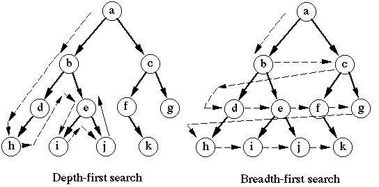

# 그래프

## 1. 그래프란?

단순히 노드(N, node)와 그 노드를 연결하는 간선(E, edge)을 하나로 모아 놓은 자료 구조, 연결되어 있는 객체 간의 관계를 표현할 수 있는 자료 구조이다.

* 그래프는 네트워크 모델 이다. => 2개 이상의 경로가 가능하다.
* 즉, 노드들 사이에 무방향/방향에서 양방향 경로를 가질 수 있다.
* self-loop 뿐 아니라 loop/circuit 모두 가능하다.
* 루트 노드라는 개념이 없다.
* 부모-자식 관계라는 개념이 없다.
* 순회는 DFS나 BFS로 이루어진다.
* 그래프는 순환(Cyclic) 혹은 비순환(Acyclic)이다.
* 그래프는 크게 방향 그래프와 무방향 그래프가 있다.
* 간선의 유무는 그래프에 따라 다르다.

## 2. 그래프 용어

* 정점(vertex): 위치라는 개념. (node 라고도 부름)
* 간선(edge): 위치 간의 관계. 즉, 노드를 연결하는 선 (link, branch 라고도 부름)
* 인접 정점(adjacent vertex): 간선에 의 해 직접 연결된 정점
* 정점의 차수(degree): 무방향 그래프에서 하나의 정점에 인접한 정점의 수
  * 무방향 그래프에 존재하는 정점의 모든 차수의 합 = 그래프의 간선 수의 2배
* 경로 길이(path length): 경로를 구성하는 데 사용된 간선의 수
* 단순 경로(simple path): 경로 중에서 반복되는 정점이 없는 경우
* 사이클(cycle): 단순 경로의 시작 정점과 종료 정점이 동일한 경우

## 3. 그래프 종류

1. 무방향 그래프(Undirected Graph)
   무방향 그래프의 간선은 간선을 통해서 양 방향으로 갈 수 있다.
   정점 A와 정점 B를 연결하는 간선은 (A, B)와 같이 정점의 쌍으로 표현한다.
   (A, B)는 (B, A) 동일
   Ex) 양방향 통행 도로
2. 방향 그래프(Directed Graph)
   간선에 방향성이 존재하는 그래프
   A -> B로만 갈 수 있는 간선은 <A, B>로 표시한다.
   <A, B>는 <B, A>는 다름
   Ex) 일방 통행
3. 가중치 그래프(Weighted Graph)
   간선에 비용이나 가중치가 할당된 그래프
   ‘네트워크(Network)’ 라고도 한다.
   Ex) 도시-도시의 연결, 도로의 길이, 회로 소자의 용량, 통신망의 사용료 등

## 4. 그래프 구현 방법

1. 인접 행렬 (adjacent matrix) : 정방 행렬을 사용하는 방법

   해당하는 위치의 value 값을 통해서 vertex 간의 연결 관계를 O(1) 으로 파악할 수 있다. Edge 개수와는 무관하게 V^2 의 Space Complexity 를 갖는다. Dense graph 를 표현할 때 적절할 방법이다.

2. 인접 리스트 (adjacent list) : 연결 리스트를 사용하는 방법

   vertex 의 adjacent list 를 확인해봐야 하므로 vertex 간 연결되어있는지 확인하는데 오래 걸린다. Space Complexity 는 O(E + V)이다. Sparse graph 를 표현하는데 적당한 방법이다.

## 5. 그래프 탐색

### 비가중치 그래프



* DFS

  stack를 이용해서 구현

  연결할 수 있는 정점이 있을 때까지 계속 연결하다가 더이상 연결되지 않은 정점이 없으면 바로 그 전 단계의 정점으로 돌아감

  Time Complexity : O(V+E)

* BFS

  queue를 이용해서 구현

  vertex 들을 방문한 순서대로 queue 에 저장

  Time Complexity : O(V+E)

### 최소 신장 트리(Minimum Spanning Tree)

모든 정점을 연결하는 간선들의 가중치의 합이 최소가 되는 트리를 찾는 것이 목표

무향 가중치 그래프에서 신장 트리를 구성하는 간선들의 가중치의 합이 최소인 신장 트리

모든 정점이 서로 연결되어 있다면 간선의 수는 최대 정점의 제곱만큼 있다.

```text
# test case
7 11 # 정점수, 간선수
0 1 32 # 정점, 정점, 가중치 
0 2 31
0 5 60
0 6 51
1 2 21
2 4 46
2 6 25
3 4 34
3 5 18
4 5 40
4 6 51
```

* 크루스칼 알고리즘(Kruskal Algorithm)

  * 탐욕적인 방법
  * 모든 간선정보를 수집한 후 최소값을 찾고
  * 기존 트리와 연결되어있으면 쓰지 않고 연결되어 있으면 더한다
  * 모든 정점이 포함될 경우 멈춘다 
  * O(E log V)

  ```python
  # 크루스칼 핵심!!! union find
  def union_find(r, index):
      global v
      # find
      for i in range(v):
          # union
          if root[i] == index:
              root[i] = r
  
  v, e = map(int, input().split()) # v: 정점 수, e: 간선 수
  # 그래프의 연결 유무 확인 툴
  root = [i for i in range(v)]
  # 간선 정보 모으기& 정렬: O(elog(e))
  edges = []
  for _ in range(e):
      x, y, val = map(int, input().split())
      edges.append((val, x, y))
  edges.sort()
  score = 0
  # 진짜 시작
  # O(e)
  for k in range(e):
      for i in range(1, v):
          if root[0] != root[i]:
              break
      else:
          break
      # 최소값 찾기(O(1))
      val, x, y = edges[k]
      if root[y] != root[x]:
          # union_find 복잡도: O(log v)
          union_find(root[x], root[y])
          score += val
  # 최종 : 정렬(O(eloge)) + 유니온-파인드 알고리즘(O(vlog V)) => O(e log V)
  print(score)
  ```

* 프림 알고리즘(Prim Algorithm)

  * 아무 정점이나 선택한 후 정점에서 나가는 모든 간선정보를 수집한다
  * 최소 비용인 간선을 선택하고 간선의 끝이 사용되지 않은 정점일 경우 그 정점에서 나가는 모든 간선정보를 수집한다
  * 모든 정점이 사용될 경우 정리한다. 
  * 우선순위 큐(힙)쓰면 O(E log V) 안쓰면 O(E**2)
  
  ```python
  from heapq import heappop, heappush, heapify
  v, e = map(int, input().split()) # v: 정점 수, e: 간선 수
  
  # 무향 그래프 표현
  graph = {i: [] for i in range(v)}
  for _ in range(e):
      x, y, val = map(int, input().split())
      graph[x].append((val, y))
      graph[y].append((val, x))
  visit = [False for _ in range(v)]
  visit[0], next = True, 0
  heap = graph[0]
  heapify(heap)
  score = 0
  cnt = 0
  while heap and cnt < v:
      # 간선의 개수만큼 heappop => O(eloge)
      val, tmp = heappop(heap)
      # 정점의 개수 만큼 heappush => O(vlogv)
      if not visit[tmp]:
          cnt, visit[tmp], next = cnt+1, True, tmp
          score += val
          for val, index in graph[next]:
            if not visit[index]:
                  heappush(heap, (val, index))
  # 최종 O(e log e + v log v) => O(e log v)
  print(score)
  ```
  
  

### 최단 거리

간선의 가중치가 있는 그래프에서 두 정점 사이의 경로들 중에 간선의 가중치가 최소인 경로

방향, 무방향 그래프 모두 상관 없다.

내비게이션에서 지도상의 각 도시들을 노드로, 도로들을 간선으로 갖는 그래프로 간주한다면, 두 도시를 잇는 가장 빠른 길을 찾는 문제같이 최단 거리를 원하는 경우 사용 가능!

* 다익스트라 알고리즘(Dijkstra Algorithm)

  * 하나의 노드로부터 최단경로를 구하는 알고리즘
  * 양의 가중치만 사용 가능
  * O((V+E)logV)

  ```python
  from heapq import heapify, heappush, heappop
  n, m = map(int, input().split())
  start, end = map(int, input().split())
  graph = {i: [] for i in range(n)}
  for _ in range(m):
      s, e, d = map(int, input().split())
      graph[s].append((e, d))
  dist = [0xffff]*n
  # 변수 초기화
  distance, x, heap = 0, start, []
  while dist[end] == 0xffff:
      # V * heappop => (O(V log V))
      if heap:
          distance, x = heappop(heap)
      # E * heappush => (O(E log V))
      if dist[x] == 0xffff:
          dist[x] = distance
          for y, d in graph[x]:
              heappush(heap, (distance+d, y))
  # heappush + heappop => O((V+E)log V))
  print(dist[end])
  ```

  

* 벨만-포드 알고리즘(Bellman-Ford Alogrithm)

  * 가능한 모든 노드쌍들에 대한 최단거리를 구하는 알고리즘
  * 음의 가중치 가능
  * O(V**3)
    1. 그래프를 초기화
    2. 정점의 개수만큼 반목문을 돌면서 모든 간선에 대해 연산 수행(O(V))
    3. 음의 가중치를 갖는 순환경로가 있는지 확인(O(E)=O(V**2)) 

* 플로이드-워셜알고리즘(Floyd-Warshall Algorithm)

  * 가능한 모든 노드쌍들에 대한 최단거리를 구하는 알고리즘
  * 음의 가중치 가능
  * O(V**3)

  ```python
  D = [
      [0, 3, 8, 0xff, -4],
      [0xff, 0, 0xff, 1, 7],
      [0xff, 4, 0, 0xff, 0xff],
      [2, 0xff, -5, 0, 0xff],
      [0xff, 0xff, 0xff, 6, 0]
  ]
  d0 = deepcopy(D)
  for k in range(5):
      d1 = deepcopy(d0)
      for j in range(5):
          for i in range(5):
              if d0[j][k] == 0xff or d0[k][i] == 0xff:
                  tmp = 0xff
              else:
                  tmp = d0[j][k] + d0[k][i]
              d1[j][i] = min(tmp, d1[j][i])
      d0 = deepcopy(d1)
      pprint(d0)
  ```

  