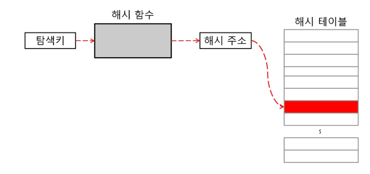

# 해시(Hash)

> https://github.com/JaeYeopHan/Interview_Question_for_Beginner/tree/master/DataStructure#hash-table

## 1. 해시란?

특정 항목을 검색하고자 할 때, 탐색키를 이용한 산술적 연산을 이용해 키가 있는 위치를 계산하여 바로 찾아가는 방법

특정한 값을 Search 하는데 데이터 고유의 인덱스로 접근하게 되므로 average case 에 대하여 Time Complexity 가 O(1)이 된다.

고유의 인덱스를 hash function을 활용하여 관리하기 때문에 인덱스가 불규칙하다.

## 2. Hash Function

탐색키를 항목의 위치로 변환하는 함수

특별한 알고리즘을 활용해 key값을 주소 값으로 변환한다.

하지만 서로 다른 key를 함수에 적용하였는데 반환된 해쉬 주소가 동일한 경우 충돌(Collision)일 발생한다.

해시 함수가 해시 주소를 아무리 공평하게 분배해도 해시 태이블에 저장되는 자료의 수가 증가하면 충돌은 반드시 생기게 된다.

무조건 1:1 로 만드는 것보다 Collision 을 최소화하는 방향으로 설계하고 발생하는 Collision 에 대비해 어떻게 대응할 것인가가 더 중요하다.

## 3. Resolve Conflict

해시 충돌을 해결 하기 위한 방법

1. 개방 주소법(Open Adress)

   해시 함수로 구한 주소에 빈 공간이 없어 충돌이 발생하면, 그 다음 공간에 빈 공간이 있는지 조사한다. => 빈 공간이 있으면 저장! 없으면 반복!

   * 순차적으로 탐색
   * 2차함수를 이용하여 탐색
   * 해쉬함수를 두번 써서 탐색 => 연산량이 많다...

2. 분리 연결법(Separate Chaining)

   해시 테이블의 구조를 변경하여 각 버킷에 하나 이상의 키 값을 가지는 자료가 저장될 수 있도록 하는 방법

   보조 해시 함수를 이용하여 조정하도록 한다.

   Java 7 에서는 Separate Chaining 방식을 사용하여 HashMap 을 구현

   * 연결 리스트사용

     각각의 버킷을 연결 리스트로 사용하여 관리

     삽입 삭제 용이 but 메모리를 많이 먹음

   * Red-Black Tree 사용

     각각의 버컷을 Red-Black Tree로 사용하여 관리

     역시 메모리 많이 먹음